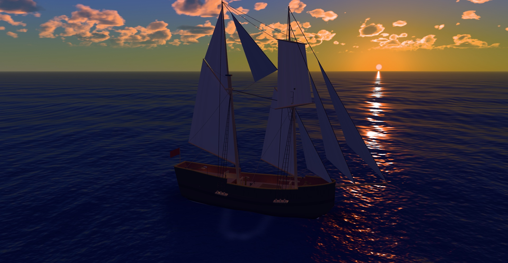
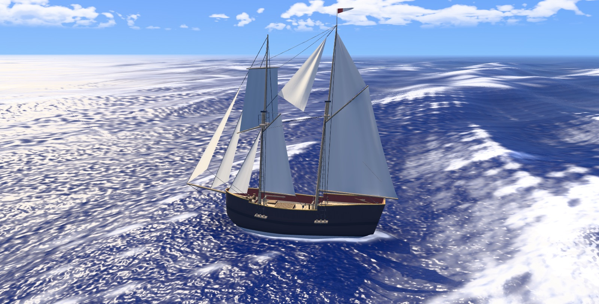
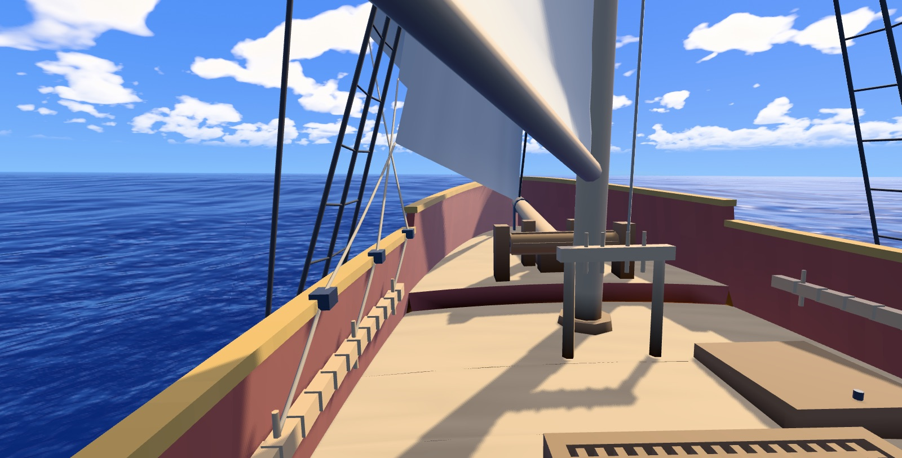
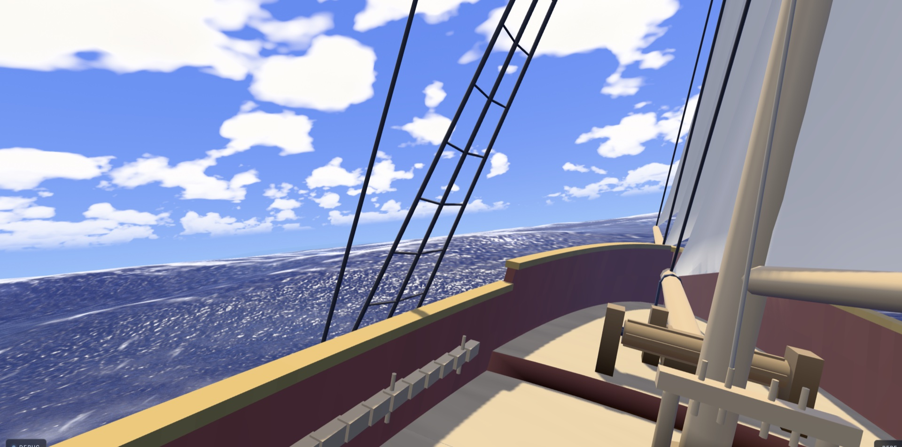
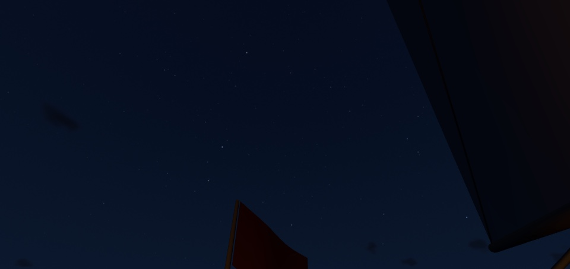
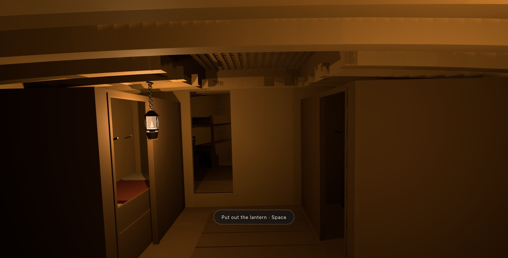
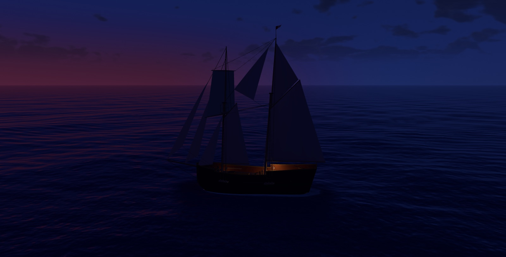

# Drift

> **Disclaimer:** this README was written by AI and not closely reviewed, so
> don't judge me for the cringey Claude-speak. The project is unfinished, but I
> didn't want it to go to waste, so it's published here for others to
> potentially use or continue.

An unfinished Three.js sailing game: a planetary ocean with spectral sea
states and calibrated whitewater, a real sky with Sun, Moon, stars and marched
clouds, terrain, a first pass at weather, and a 15.5 m topsail schooner that
sails under her own canvas, with a walkable deck, five spaces below it, and a
crew you never see.



**Status: on hold, released as-is.** Development is paused rather than
abandoned, and pull requests are welcome. It never became a game in the sense
of having something to *do*; what was learned from that is written up below.
The design documents, project plans, round reports and session handovers that
drove the work are included under `docs/`.

| | |
|---|---|
|  |  |
| A rough Southern Ocean sea state: wind sea, swell and whitecaps | The weather deck from the port gangway |
|  |  |
| The same sea from the rail, captured in play | Astronomical night from the helm: the HYG catalogue at its real, faint magnitudes |
|  |  |
| Below decks at night: the lanterns are real lights you can light and put out | Dusk, with the deck lamps lit |

## Quick start

Node 20.19 or newer, and a browser with WebGL2.

```bash
npm install
```

```bash
npm run dev
```

Open the printed URL. The page loads on a beam reach with a course already
ordered and someone at the tiller. Drag to look, scroll to change the camera
scale, press `V` to step aboard.

| Input | Outside the ship (cinematic) | Aboard (embodied) |
|---|---|---|
| Drag / one-finger drag | Orbit the ship | Look around (touch: drag the right side) |
| `WASD` / arrows, or left-side touch drag | — | Walk the deck and go below |
| Mouse wheel / pinch | Scale, 12 m to 1.4 km | — |
| `V`, or double-tap open water | Step aboard | Step outside |
| `Space` | — | Use what you are looking at: hatches, lanterns, the desk, the berths |
| `M` | Mute the ambience | Mute the ambience |
| `\` | Hide every scrap of interface | Hide every scrap of interface |

The page opens in the developer shell: a **Debug** pill in the bottom-left
corner with every panel, laboratory, switch and trim, described in the
[developer guide](docs/project/DEVELOPER_GUIDE.md). There is also a
player-facing interface behind `?player`, added late so a link could be sent
to someone without the confusing knobs and their feedback collected: five
pages of helm and compass, sea state, sky and time of day, view settings and a
frame-time readout. Be clear about what it is, though: still a set of knobs
for playing with the engine, not a game UI.

Some URLs worth trying:

| URL | What it does |
|---|---|
| `?debug=ocean` | Straight to the sea-state laboratory; `?debug=camera`, `?debug=inspect` and `?debug=buoyancy` deep-link other panels |
| `?player` | The player-facing interface instead of the developer shell |
| `?solarTime=19.2` | A frozen frame at a stated solar time, interface hidden: the capture conditions `tools/inspect-view.mjs` uses. `sea=`, `stand=`, `look=`, `lamps=` and `view=` compose with it |

## What is in here

**A planetary world.** Canonical position and velocity are WGS84 ECEF, not a
flat plane. Voyages are ellipsoidal geodesics with a parallel-transported
tangent frame, so the ship can cross a pole or the antimeridian without a seam.
The Sun and Moon come from an ephemeris, the stars are the HYG catalogue to
magnitude 6.5 with the Milky Way behind them, and local apparent solar time,
day of year and position are all live controls.

**An ocean with a spectrum.** Sea states are described the way oceanographers
describe them, as wind speed, fetch and development plus independent primary
and secondary swell, then discretised into 48 Gerstner components. Whitecap
coverage is calibrated against Monahan's measurements. Foam persists in a field
indexed in wave-parameter space, crest spray is torn off in the wind, and the
same wave definition is sampled on the CPU for buoyancy and on the GPU for the
surface, with the parity pinned by test. The presets run from dead calm to a
rough Southern Ocean.

**Sky, light and clouds.** An analytic atmosphere; a marched three-dimensional
cloud field with altitude decks, a cirrus deck, a world-time cloud clock and a
tile cache so it stays affordable; a world lighting model with per-term
diagnostic views; a hue-preserving tone curve; a sun shadow pass with a variable
penumbra and hull sky-occlusion; a night sky in which the star field and the
moonlight are both derived from what is actually up there.

**A ship, built and walkable.** A two-masted topsail schooner from real hull
offsets: hydrostatics, distributed 240 Hz buoyancy, roll and pitch decay, a
passive resistance surface and force-integrated surge, sway and yaw. The
weather deck has its fittings and a camber; below it are the captain's
quarters with a desk you can sit at, the wardroom, the forecastle, the hold and
its stow, and the pump well, lit in daylight through a portal model and at
night by five lanterns that are real lights. Doors, hatches and deadlights are
one closure table read by the lighting, the walker, the interaction system and
the sea.

**She sails.** Eight sails make lift and drag at their real centres of effort
from the instantaneous apparent wind, with induced drag, aback lift and live
camber; the six principal sails are deformable cloth. A rudder steers her. An
invisible crew works six trimmer stations and a helmsman holds a course or an
apparent wind angle; a navigator sails her to a point, beating when she must,
and shortens sail under a canvas policy. There is no captive tow and no
prescribed motion in the production path.

**Wake, weather, sound, terrain.** A bow pressure front, stern and transom
wake, a hull wet band and bow-entry spray, all strictly one-way from the hull
into the picture. A pressure record upstream of the wind, a barometer, and a
clear/rain/storm weather model (`?weather=storm`) that landed last and is the
roughest thing here: the rain in particular is a first pass. Six synthesised
voices for the ambience, derived from state that already exists. Anchored
synthetic land with distance haze, and a coarse Natural Earth globe.

**Two cameras and a body.** A cinematic camera that climbs as it retreats,
holding the horizon a third of the way down the frame at every scale, and an
embodied camera at the eyes of a body that walks the deck, ducks below, climbs
aloft and sits down, with a head model that takes the hull's heave but cuts
its roll to a tenth.

**Tooling for looking.** A headless capture tool that renders a named viewing
condition to a PNG and a machine-readable lighting probe, paired A/B contact
sheets for look decisions, a GPU benchmark harness with paired interleaved
blocks, and a scene inspection ray recorder. Most of the graphics rounds were
argued with these rather than by eye alone.

## Tests

```bash
npm test
```

The fast suite is about 1,900 tests and runs in under a minute: geodesy against
official vectors, the astronomy, the spectral sea state and its whitecap
calibration, shader-source hazards, ship hydrostatics and decay, rig and deck
geometry, sailing aerodynamics and steering, the interior and its closures, the
lighting model and the committed evidence baselines. `npm run test:full` adds
the slow simulations. `npm run build` type-checks and bundles. See
[docs/project/TESTING.md](docs/project/TESTING.md).

## Layout

```
src/
  world/       WGS84, geodesics, clocks, the opening voyage
  astronomy/   Sun, Moon, sidereal time, the star catalogue and Milky Way
  ocean/       sea states, spectra, presets, the sea-state controller
  scene/       water, sky, clouds, stars, lighting, lamps, shaders
  vessel/      the schooner: hull, rig, sails, crew, deck, interior, closures
  weather/     pressure, wind, rain and storm presentation
  camera/      the cinematic and embodied cameras
  player/      the walking body, seats, and what can be used
  runtime/     the frame transaction and the diagnostics hosts
  render/      GPU profiling, adaptive resolution, temporal resolve
  hud/ ui/     the player interface and the developer shell
  debug/       the laboratories and inspection panels (lazy-loaded)
  audio/       the synthesised ambience
  terrain/     tiles, synthetic land, the coarse globe
tests/         the Vitest suites
tools/         capture, inspection, A/B sheets, evidence exporters, perf harness
evidence/      committed baselines the tests read, and A/B contact sheets
docs/          design specs, round reports and handovers, by subject
```

The [documentation index](docs/README.md) lists roughly a hundred design
documents, reports and handovers by subject. They are long, opinionated and
written to be picked up cold. The [developer guide](docs/project/DEVELOPER_GUIDE.md)
covers the evidence exporters, the developer shell and its direct links, and a
file-by-file map of the source tree.

## How it was built, and what was learned

This was an experiment in building something substantial with AI coding
agents. Nearly all of the code and documentation was written by the models:
Claude Opus 5 and Claude Fable 5 in Claude Code, and GPT-5.6 Sol in Codex.
The work ran as feature streams, each with a design document and a handover
document, worked through as a series of milestones in session with the
handover kept current as the milestones landed. That is the shape of `docs/`.
The human at the wheel, Ash, set direction, looked at every frame, and made
the calls that needed an eye, which is why the docs and comments keep saying
so. The handover documents are left in place as a record of how that went,
including what was tried and rejected.

The lesson is the ordinary one, learned the expensive way: prototype the
*game* first and find out whether it is fun, then spend on the water and the
light. This project did it the other way round. The ocean is good, the ship is
good, the sailing is real, and there is still nothing to do aboard her except
look, which is not nothing, but is not a game. If you are starting your own,
start with the loop. If you want to pick this one up, the
[review queue](docs/project/REVIEW_QUEUE.md) and
[deferred rounds](docs/project/FUTURE_ROUNDS.md) are where the threads were
left, and pull requests are welcome.

## Licence and credits

Code is under the [MIT licence](LICENSE).

The bright-star data is a subset of the [HYG Database](https://github.com/astronexus/HYG-Database)
(CC BY-SA 4.0) and the Milky Way is a downsampled derivative of NASA's
[Deep Star Maps 2020](https://svs.gsfc.nasa.gov/4851) (CC BY 4.0); both are
baked into generated TypeScript rather than shipped as files. Nothing else is
loaded from outside the repository: every mesh, texture, sound and sky is
procedural. Full provenance, including the source checksums and the regeneration
scripts, is in [docs/project/ASSET_CREDITS.md](docs/project/ASSET_CREDITS.md).

This repository starts from a single squashed commit. The development history
behind it, several hundred commits across many branches, stays private.
